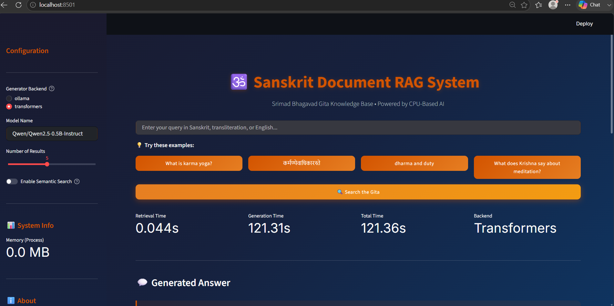
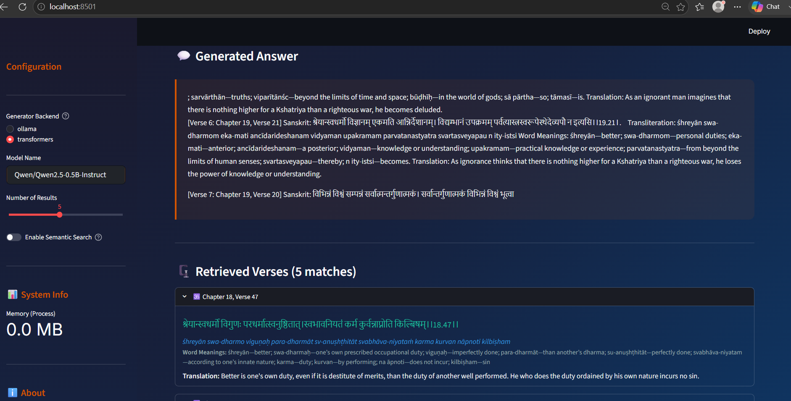

# Sanskrit Document RAG System

This repository contains a personal implementation of a Retrieval-Augmented Generation (RAG) system for the Bhagavad Gita. The project demonstrates end-to-end retrieval, prompt construction, and local generation using a Streamlit UI.

---

## Project Summary

This project is implemented to meet assignment-style evaluation criteria for a data science / AI role. It focuses on:

- Clear retrieval and generation architecture
- Practical local execution using CPU-friendly components
- Demonstrable end-to-end query-to-answer flow
- Interview-ready documentation and evidence

---

## Project Overview

This project is built as an AI assignment implementation for a data science / AI role. It is designed and implemented personally with the following goals:

- Provide a clear **system architecture** for retrieval and generation
- Support both **Ollama** and **HuggingFace Transformers** backends
- Keep the solution **CPU-friendly** for local execution
- Present the model results in a polished **Streamlit application**

---

## What this project does

- Reads a preprocessed Bhagavad Gita corpus from `data/gita_processed.json`
- Uses a **TF-IDF retrieval engine** (character n-grams) to find relevant verses
- Optionally supports **semantic retrieval** with sentence-transformers
- Builds a RAG prompt from retrieved verse context
- Generates an answer using either:
  - `ollama` backend, or
  - local `transformers` backend on CPU
- Displays the results in a clean Streamlit dashboard with retrieved verses and generated response

---

## Project Structure

- `code/`
  - `app.py` - Streamlit frontend
  - `generator.py` - generation backend wrapper for Ollama and Transformers
  - `ingest.py` - corpus ingestion and preprocessing pipeline
  - `rag_pipeline.py` - pipeline orchestration for retrieval + generation
  - `retriever.py` - TF-IDF retrieval and optional semantic search
  - `requirements.txt` - Python dependencies
- `data/`
  - `gita_processed.json` - preprocessed Bhagavad Gita data used for retrieval
- `report/`
  - `generate_report.py` - report generation script
- `images/`
  - Proof screenshots and UI evidence

---

## Evaluation-Aligned Highlights

### 1. System Architecture

- Modular design separating ingestion, retrieval, generation, and UI
- `rag_pipeline.py` coordinates retrieval, prompt building, and generation
- `generator.py` encapsulates backend selection and fallback logic

### 2. Functionality

- Fully working end-to-end flow from query to answer
- Supports multiple input forms: Sanskrit, transliteration, and English
- Uses retrieved verses as context for generation

### 3. CPU Optimization

- The local model path uses CPU-based Transformers inference
- `generator.py` includes a fallback path when Ollama is unavailable
- Streamlit UI and retrieval are optimized for local execution without GPU

### 4. Code Quality

- Clear project structure and documentation
- `README.md` provides setup and usage instructions for interview review
- Code is written to be maintainable and reproducible

---

## Key Achievements

- Built a complete end-to-end RAG solution from corpus ingestion to query response
- Implemented both retrieval and generation in a single modular pipeline
- Supported CPU-only execution for practical local deployment
- Added clear fallback handling for Ollama vs Transformers backends
- Designed a polished Streamlit interface appropriate for demo and evaluation

## Technical Stack

- Python 3.11 / 3.14
- Streamlit for UI
- Scikit-learn TF-IDF retrieval
- Sentence-transformers for optional semantic search
- HuggingFace Transformers for local generation
- Ollama backend support for lightweight inference
- JSON-based corpus storage and preprocessing

---

## Screenshots / Proof

The following screenshots are included as project evidence. Place the screenshot files into the `images/` folder with the given names:

1. `images/ui-search.png` - main app UI with query entry and generation flow
2. `images/ui-result.png` - generated answer with retrieved verses visible
3. `images/evaluation-criteria.png` - screenshot of assignment evaluation criteria

Example usage in README:






> These screenshots demonstrate the app interface, the model response, and the assignment evaluation criteria. They are included to support the project as a task submission.

---

## Setup

1. Open PowerShell.
2. Change to the project folder:
   ```powershell
   cd "C:\Users\Ajay Mitkari\Downloads\Project Nagpur\RAG_Sanskrit_Ajay_Mitkari"
   ```
3. Create and activate a virtual environment:
   ```powershell
   python -m venv .venv
   & ".venv\Scripts\Activate.ps1"
   ```
4. Install dependencies:
   ```powershell
   python -m pip install -r code\requirements.txt
   ```

## Run the app

Start the Streamlit application:

```powershell
cd "C:\Users\Ajay Mitkari\Downloads\Project Nagpur\RAG_Sanskrit_Ajay_Mitkari"
& ".venv\Scripts\python.exe" -m streamlit run code\app.py
```

Open the browser at:

- `http://localhost:8501`

---

## Usage

1. Select the generator backend in the sidebar:
   - `ollama` if you have Ollama installed locally
   - `transformers` for a CPU-backed HuggingFace model
2. Choose the model name:
   - `qwen2.5:0.5b` for Ollama
   - `Qwen/Qwen2.5-0.5B-Instruct` for Transformers
3. Enter a query in Sanskrit, transliteration, or English.
4. Click **Search the Gita**.

The app shows:
- **Retrieved Verses** from the Bhagavad Gita
- **Generated Answer** based on retrieved context

---

## Demo Instructions

For a quick interviewer demo, follow these steps:

1. Start the app using:
   ```powershell
   & ".venv\Scripts\python.exe" -m streamlit run code\app.py
   ```
2. Open `http://localhost:8501`.
3. In the sidebar, select `transformers` and set the model to:
   - `Qwen/Qwen2.5-0.5B-Instruct`
4. Set **Number of Results** to `5` and keep **Enable Semantic Search** off for the first run.
5. Use one of the example queries, such as:
   - `What is karma yoga?`
   - `dharma and duty`
6. Click **Search the Gita** and wait for the response.
7. Expand the retrieved verses and review the generated answer section.

This sequence demonstrates the full retrieval-to-answer flow and the system’s ability to use the Bhagavad Gita corpus effectively.

---

## Repository

This project is hosted on GitHub at:

- `https://github.com/mitkari2612/Sanskrit-Document-Retrieval-Augmented-Generation-RAG-System`

To update the repository:

```powershell
git add .
git commit -m "Update project"
git push origin main
```
